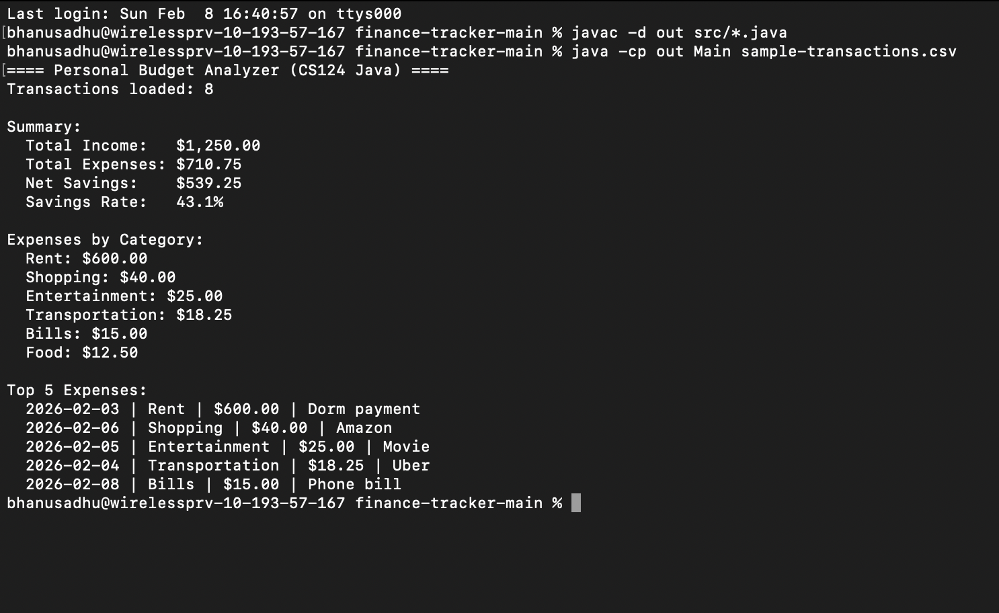

# Personal Budget Analyzer (Java)

A beginner-friendly financial analysis tool built in **Java** that reads transaction data from a CSV file and generates savings metrics and spending insights.

This project demonstrates foundational programming concepts including object-oriented design, file I/O, data aggregation, and sorting algorithms applied to personal finance analytics.

---

## Features

- Parses CSV transaction data  
- Calculates total income and total expenses  
- Computes net savings and savings rate  
- Breaks down spending by category  
- Identifies top expenses  
- Demonstrates array-based aggregation and sorting logic  

---

## Sample Output



---

## How to Run

### 1. Download the Repository

Click **Code → Download ZIP** on GitHub and unzip the folder.

---

### 2. Compile the Program

From the project root directory:

```bash
javac -d out src/*.java
```

---

### 3. Run the Program

```bash
java -cp out Main sample-transactions.csv
```

---

## CSV Input Format

The program expects a CSV file structured as:

```
date,type,category,amount,note
```

### Example:

```
2026-02-02,expense,Food,12.50,Chipotle
2026-02-03,expense,Rent,600,Dorm payment
2026-02-07,income,Income,50,Birthday gift
```

---

## Project Structure

```
finance-tracker/
│
├── README.md
├── sample-transactions.csv
├── output.png
│
└── src/
    ├── Main.java
    ├── Transaction.java
    ├── CsvReader.java
    └── BudgetReport.java
```

---

## Concepts Demonstrated

- Object-Oriented Programming (OOP)
- File Input / Output (CSV parsing)
- Array manipulation
- Data aggregation
- Selection sorting algorithms
- Financial metric computation

---

## Future Improvements

- GUI or web interface  
- Budget forecasting  
- Investment tracking  
- Database integration  
- Data visualization dashboards  

---

## Author

**Bhanu Prakash Sadhu**  
Computer Science + Economics — UIUC
